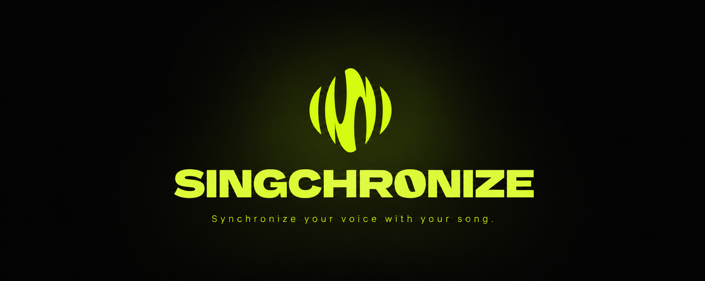
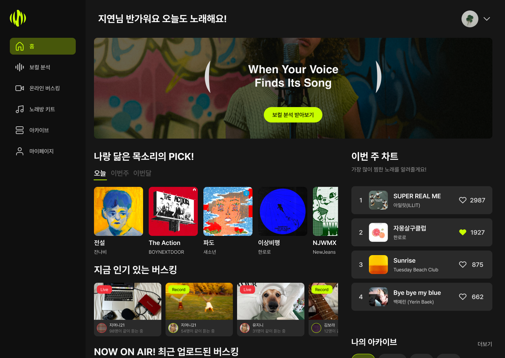
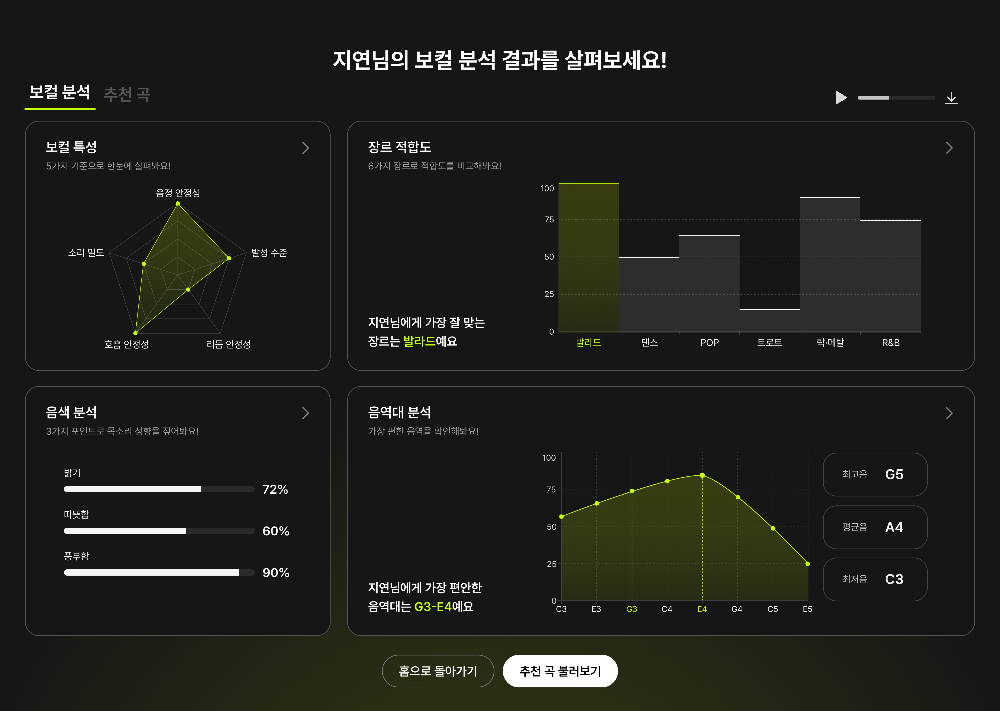
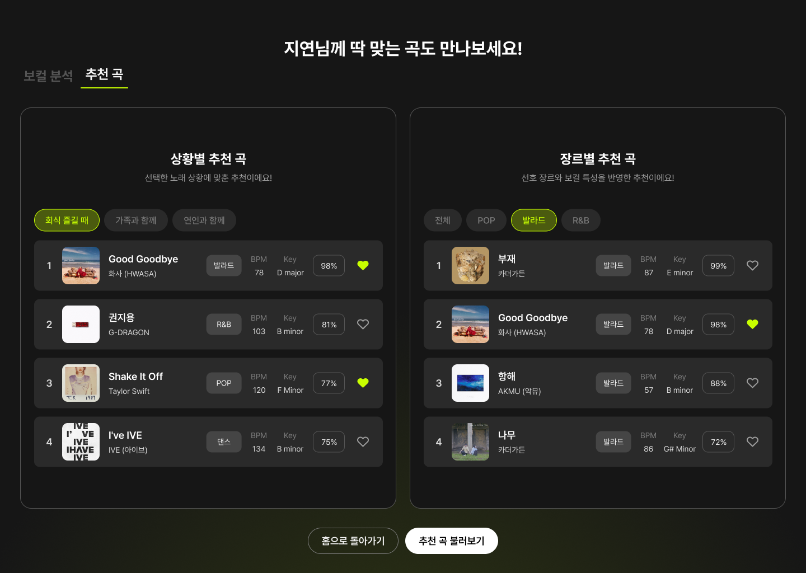
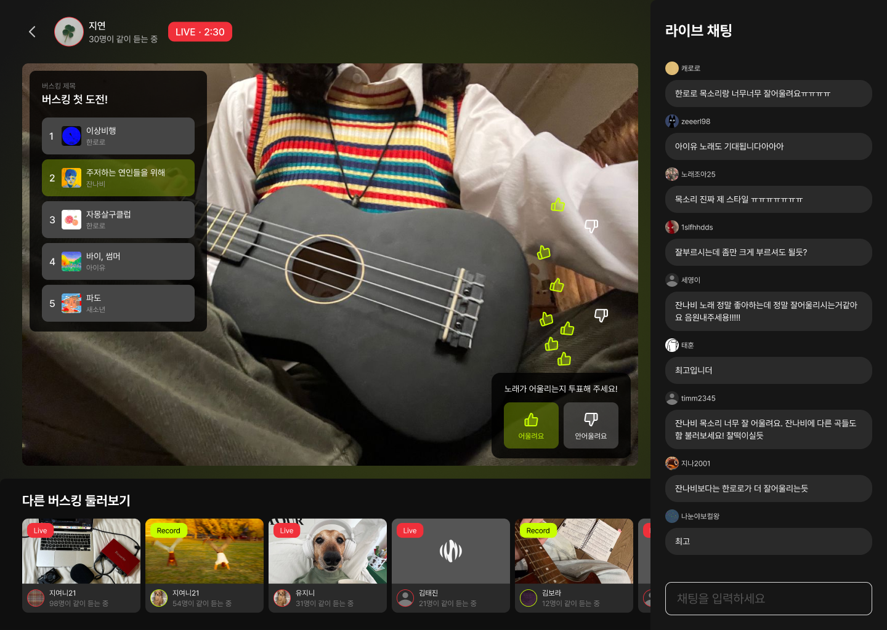
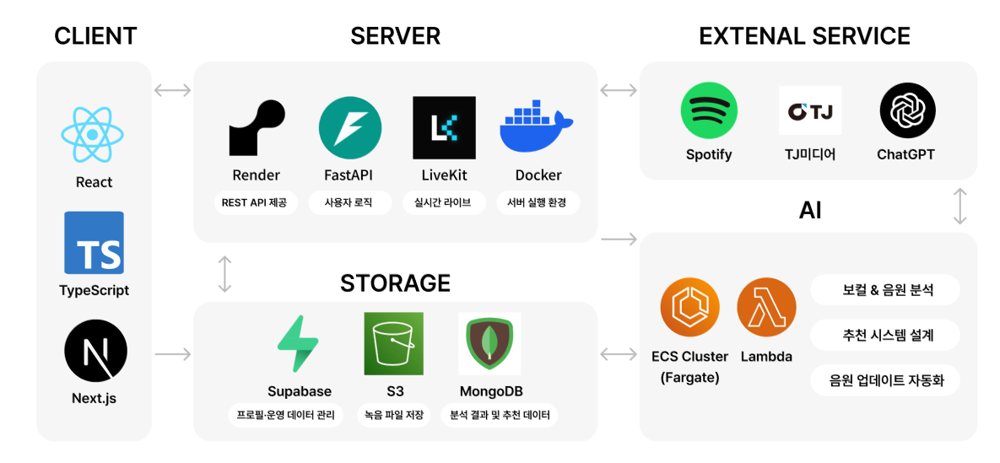

# SINGCHRONIZE

<div align="center">
  
</div>

> **Synchronize your voice with your song.**<br>
> 사용자의 음성 특징 벡터 분석을 통한 개인 맞춤형 가창 곡 추천 서비스

<div align="center">


<br/>

🏆 **이화여자대학교 2026 컴퓨터공학과 캡스톤 디자인 포스터 세션 최우수상**

</div>

---

## 📌 Project Overview

**SINGCHRONIZE**는 기존의 단순 텍스트 기반 검색이나 획일화된 인기 차트 중심의 노래방 추천 방식에서 벗어나, 사용자의 실제 음성 데이터(Acapella)를 정밀 분석하여 최적의 가창 곡을 제안하는 **초개인화 오디오 인텔리전스 서비스**입니다. 

단 한 번의 보컬 녹음으로 사용자의 음역대, 음색 벡터, 발성 능력을 다차원적으로 평가하며, 딥러닝 기반 임베딩 모델을 거쳐 개인화된 보컬 리포트와 매칭 파이프라인을 제공합니다. 더 나아가 자신의 목소리를 공유하고 실시간으로 소통할 수 있는 온라인 버스킹 환경을 통해 지속 가능한 오디오 생태계를 구축합니다.

---

## 📱 Product Interface & UX Flow

> 💡 **Visual Proof First (Strict 1:1 Grid Layout)**
> 핵심 사용자 경험(UX) 흐름을 직관적으로 확인할 수 있는 메인 인터페이스 자산입니다. 디바이스 환경에 구애받지 않고 완벽한 균등 그리드로 정렬되도록 아키텍처를 설계했습니다.

<table>
  <tr>
    <td width="50%" align="center"><strong>01. 메인 대시보드</strong></td>
    <td width="50%" align="center"><strong>02. 다차원 보컬 분석</strong></td>
  </tr>
  <tr>
    <td align="center"></td>
    <td align="center"></td>
  </tr>
  <tr>
    <td valign="top"><strong>초개인화 피드 & 실시간 트렌드</strong><br><sub>개인화 추천 피드, 실시간 인기 버스킹 및 커뮤니티 트렌드를 한눈에 확인하는 메인 화면</sub></td>
    <td valign="top"><strong>5대 지표 & 정밀 음역대 트래킹</strong><br><sub>오디오 피처 추출 엔진을 기반으로 구현된 5차원 보컬 특성 다이어그램 및 분석 UI</sub></td>
  </tr>
</table>

<br>

<table>
  <tr>
    <td width="50%" align="center"><strong>03. 맞춤형 곡 추천</strong></td>
    <td width="50%" align="center"><strong>04. 온라인 버스킹</strong></td>
  </tr>
  <tr>
    <td align="center"></td>
    <td align="center"></td>
  </tr>
  <tr>
    <td valign="top"><strong>상황별 · 장르별 최적화 매칭</strong><br><sub>사용자 컨텍스트(상황별 필터) 및 AI 분석 모델 결합도를 정밀 반영한 매칭 엔진 결과</sub></td>
    <td valign="top"><strong>저지연 대화형 실시간 스트리밍</strong><br><sub>저지연 스트리밍 인프라 및 가창 스케줄러를 적용한 대화형 온라인 버스킹 플레이어</sub></td>
  </tr>
</table>

---

## 🎯 Key Engineering Features

### 1. AI 기반 고차원 보컬 오디오 파이프라인
* **정밀 음역대 및 테시투라(Tessitura) 추출**: 단발성 최고/최저음을 넘어, 가창자가 안정적으로 소화할 수 있는 핵심 음역대인 테시투라를 통계학적으로 산출합니다.
* **CREPE 기반 F0 추적**: 최신 피치 추출 모델인 `CREPE(Convolutional Representation for Pitch Estimation)`를 활용하여 노이즈가 포함된 환경에서도 정확한 기본 주파수(F0)를 트래킹합니다.
* **ECAPA-TDNN 음색 임베딩**: `SpeechBrain` 프레임워크의 `ECAPA-TDNN` 알고리즘을 활용하여 사용자의 음색을 192차원의 정밀 고밀도 벡터로 임베딩하여 유사도를 계량화합니다.
* **음원 분리 인프라**: 반주 및 보컬 데이터 진입 시 `Demucs` 파이프라인을 통하여 무손실 MR 분리 후 정밀 분석을 수행합니다.

### 2. 3단계 추천 파이프라인 엔진 (Recommendation Pipeline)
최적의 추천 신뢰도를 확보하기 위해 독립된 3단계의 필터링 및 랭킹 모델을 적용했습니다.


```

[Raw Audio] ──> (1) ECAPA-TDNN 임베딩 분석 ──> 고음색 유사 후보군 스크리닝 (Top-K)
──> (2) 가창 가능 음역대 검증 ──> 사용자 테시투라 외 이탈 곡 필터링 (Hard Filtering)
──> (3) 고차원 벡터 유사도 정렬 ──> 사용자 맞춤 최적 가창 곡 최종 추천 (Top-N)

```

### 3. 고성능 아키텍처 및 미디어 인프라
* **FastAPI Async Router**: 오디오 전처리 및 임베딩 추론 등 대규모 I/O 및 CPU 바운드 태스크의 효율적 처리를 위해 비동기(Async/Await) 아키텍처와 분리된 워커 시스템을 도입했습니다.
* **JWT 기반 Refresh Token Rotation (RTR)**: 사용자 인증 보안 강화를 위해 액세스 토큰 만료 시 리프레시 토큰을 단 1회만 재사용 가능하도록 회전시키는 RTR 메커니즘을 백엔드에 직접 구현했습니다.
* **FSD (Feature-Sliced Design) 아키텍처**: 프론트엔드는 도메인과 비즈니스 로직 중심의 슬라이스로 결합도를 낮추고 응집도를 높인 FSD 아키텍처를 도입하여 대규모 기능 확장성을 확보했습니다.
* **Turborepo 모노레포 아키텍처**: 빌드 캐싱 및 멀티 패키지 의존성 최적화를 통해 개발 생산성을 극대화했습니다.

---

## 🏗️ System Architecture

<div align="center">
  
</div>

---

## 🛠️ Technical Stack Matrix

### Frontend

| Stack | Purpose | Rationale |
| --- | --- | --- |
| **Next.js 15 (App Router)** | Core Framework | 최적의 SSR/ISR 제어 및 라우팅 성능 최적화 |
| **TypeScript** | Language Standard | 정적 타입 시스템 컴파일 시점 에러 제어로 코드 안정성 확보 |
| **Tailwind CSS** | Styling Engine | 유틸리티 퍼스트 기반 신속하고 일관된 디자인 시스템 유연성 확보 |
| **Turborepo** | Monorepo Orchestrator | 프론트엔드 종속성 통합 및 빌드 캐싱을 통한 CI/CD 가속화 |
| **Feature-Sliced Design** | Structural Architecture | 레이어드 아키텍처 기반 결합도 분리로 유지보수 편의성 극대화 |

### Backend & Infrastructure

| Stack | Purpose | Rationale |
| --- | --- | --- |
| **FastAPI** | Core API Framework | 비동기 지원 및 Pydantic 기반 데이터 검증 자동화로 초고속 API 서빙 |
| **Supabase (PostgreSQL)** | RDBMS & Auth Context | 안전한 관계형 데이터 모델링 및 실시간 버스킹 상태 동기화 인프라 |
| **AWS S3** | Object Storage | 대용량 아카펠라 고음질 녹음 데이터 파일 아카이빙 및 안정적 CDN 서빙 |
| **Poetry** | Dependency Management | 결정론적 빌드를 위한 의존성 격리 및 패키지 락킹 유연화 |

### AI Pipeline & Audio Engineering

| Stack | Purpose | Rationale |
| --- | --- | --- |
| **CREPE** | Pitch Extraction | 심층 신경망 알고리즘 기반 타겟 F0 주파수 추적의 정확도 극대화 |
| **ECAPA-TDNN** | Voice Embedding | SpeechBrain 아키텍처 적용, 고차원 음색 유사도 유클리드 거리를 산출 |
| **librosa / SciPy** | Audio Signal Processing | 오디오 신호 스펙트로그램 변환, 다차원 오디오 피처 정밀 추출 수량화 |

---

## 📂 Repository Blueprint

```text
SINGCHRONIZE/
├── frontend/                       # Next.js 프론트엔드 모노레포 워크스페이스
│   ├── apps/
│   │   └── client/                 # 메인 유저 클라이언트 애플리케이션
│   │       └── src/
│   │           ├── app/            # Next.js App Router (메인 뷰 레이어 페이지 라우트)
│   │           ├── entities/       # 비즈니스 엔티티 모델 레이어 (User, Song, Busking)
│   │           ├── features/       # 유저 인터랙션 기능 구현 레이어 (Recommend, AudioRecord)
│   │           ├── widgets/        # 독립적 컴포넌트 조합 레이어 (VocalReportCard, Navigation)
│   │           └── shared/         # 공통 유틸리티, UI 에셋, API 클라이언트 모듈
│   └── turbo.json                  # Turborepo 오케스트레이션 파이프라인 설정
│
├── backend/                        # FastAPI 백엔드 엔지니어링 아키텍처
│   └── app/
│       ├── routers/                # 도메인별 분리된 고성능 엔드포인트 제어 계층
│       ├── services/               # 비즈니스 아키텍처 및 핵심 도메인 로직 처리 계층
│       ├── models/                 # SQLAlchemy / Supabase 엔티티 관계 매핑 모델 계층
│       ├── schemas/                # Pydantic 기반 입출력 데이터 정밀 유효성 검증 계층
│       └── main.py                 # ASGI 애플리케이션 초기화 및 미들웨어 통합 엔트리포인트
│
├── ai/                             # 오디오 인텔리전스 및 추론 엔진 파이프라인
│   ├── scripts/
│   │   ├── vocal_analysis/         # 오디오 시널 전처리 및 피처 정량 가공 스크립트
│   │   │   ├── advanced_vocal_analysis.py  # 메인 오디오 추론 및 다차원 분석 모듈
│   │   │   └── radar_chart_descriptions.py # 레이더 차트 매핑용 보컬 가이드 메타데이터
│   │   ├── yt_download_worker.py   # 미디어 데이터베이스 수집용 비동기 크롤러 워커
│   │   └── tj_to_db.py             # 노래방 메타데이터 인덱싱 및 관계형 DB 마이그레이션 도구
│   └── pretrained_models/          # 고성능 추론용 음색 임베딩 모델 웨이트 스토리지
│
└── contracts/
    └── openapi.yaml                # API First Design 원칙 준수를 위한 상호 규격 계약서

```

---

## 👥 Our Team


<div align="center">

| [](https://github.com/youtheyeon) | [](https://github.com/Minju-Kimm) | [](https://github.com/dldbstj22) |
|:---:|:---:|:---:|
| **유서연** | **김민주** | **이윤서** |
| Frontend Engineer | Backend Engineer | AI Engineer |

</div>

### 💻 R&D Contributions

#### 🟢 유서연 (Frontend)

* **Monorepo & FSD Pipeline**: Turborepo 기반 고성능 모노레포 구축 및 FSD 레이어링 아키텍처를 전면 도입하여 대규모 기능 추가에 대한 컴포넌트 유연성 확보.
* **Audio Interactivity Web API**: 브라우저 기반 미디어 레코딩 파이프라인의 실시간성 제어 및 가창 오디오 스트리밍 최적화 환경 설계.

#### 🔵 김민주 (Backend)

* **High-Performance Async Architecture**: FastAPI를 기반으로 비동기 멀티스레딩 라우터를 완전 구조화하여 고비용 오디오 입출력의 병목 현상을 해결 및 아키텍처 토대 설계.
* **Advanced Session & DB Security**: Refresh Token Rotation (RTR) 메커니즘 엔지니어링을 통한 사용자 인증 흐름의 원천적 탈취 방지 프로세스 확립 및 관계형 DB의 정밀 인덱싱 튜닝 수행.

#### 🟣 이윤서 (AI)

* **Audio Deep Learning Engine**: CREPE 모델 및 ECAPA-TDNN 오디오 임베딩 파이프라인 최적화를 통해 192차원 보컬 고유 특징 벡터 추출 모듈 구현 성공.
* **Mathematical Tessitura Analytics**: 가창 데이터 주파수 스펙트럼 기반 다차원 스케일링 알고리즘 및 장르 적합도 평가 통계적 스코어링 프레임워크 수립.

---

**SINGCHRONIZE — Synchronize your voice with your song.** All rights reserved © 2026 All Day Project (Growth 32).