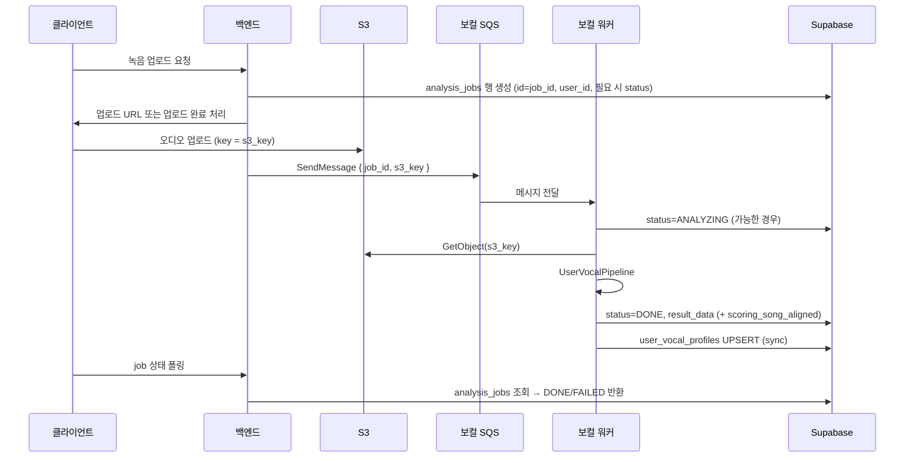
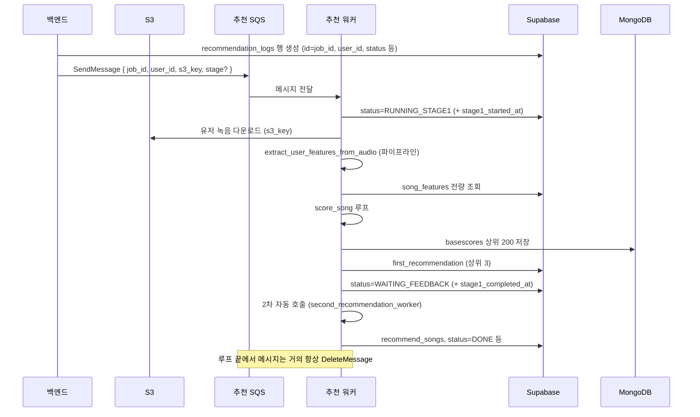
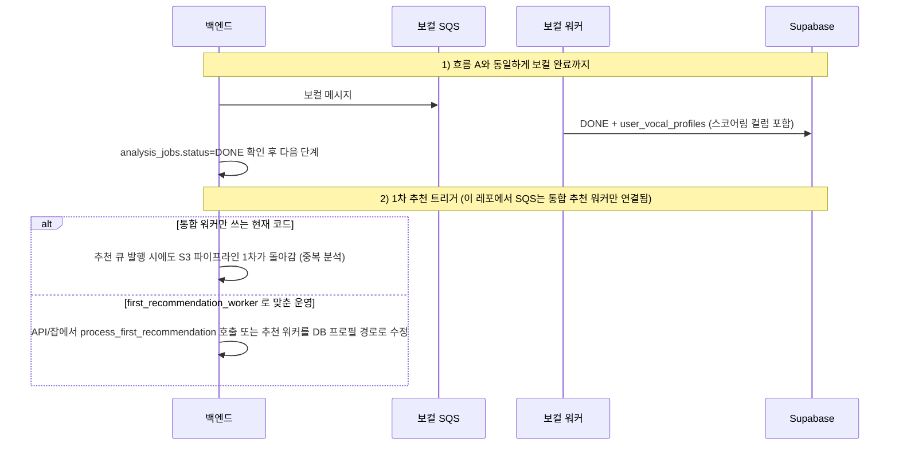

# 백엔드 ↔ AI 워커 비동기 파이프라인 계약서

이 문서는 **현재 레포의 Python 워커 코드**를 기준으로 (1) **엔드투엔드 흐름**(누가 무엇을 어떤 순서로 하는지)과 (2) **계약**(필드명·상태값·SQS Body·삭제 정책)을 같이 정리한 것이다.  
구현 세부는 다음 파일이 단일 근거(Single source of truth)다.

| 영역 | 파일 |
|------|------|
| 보컬 분석 워커·SQS | `ai/scripts/vocal_analysis/vocal_analysis_worker.py` |
| 보컬 `result_data` 슬라이스 | `ai/scripts/vocal_analysis/report_for_db.py` |
| 보컬 완료 후 프로필 동기화 | `ai/scripts/vocal_analysis/user_vocal_profile_sync.py` |
| 1차 추천(프로필/파이프라인 분기) | `ai/scripts/recommendation/first_recommendation_worker.py` |
| 추천 통합 워커·SQS | `ai/scripts/recommendation/recommendation_worker.py` |
| 2차 추천 | `ai/scripts/recommendation/second_recommendation_worker.py` |
| `user_vocal_profiles` 스코어링 컬럼 DDL | `ai/scripts/vocal_analysis/sql/add_user_vocal_profiles_song_aligned_columns.sql` |

---

## 전체 흐름 (이 문서가 다루는 범위)

계약서(아래 절들)는 **“무엇을 보내고, DB에 무엇이 쌓이는가”** 이고, 이 절은 **“백엔드가 어떤 순서로 이벤트를 쏘고, 워커가 무엇을 이어 받는가”** 를 한 번에 본다.

### 구성 요소 역할

| 구분 | 주체 | 하는 일 |
|------|------|---------|
| 백엔드/API | 서버 | `analysis_jobs` / `recommendation_logs` 행 생성·상태 노출, S3 업로드 URL 또는 업로드 완료 처리, **SQS에 JSON 메시지 발행**, 클라이언트 폴링/Webhook |
| 보컬 워커 | ECS/Fargate 등 | 보컬 큐 소비 → S3에서 오디오 다운로드 → `analysis_jobs` 갱신 → `user_vocal_profiles` UPSERT |
| 추천 워커 | 동일 또는 별 태스크 | 추천 큐 소비 → (현재 통합 코드 기준) S3·Mongo·`recommendation_logs` 갱신 |

큐가 **두 개**이므로, “한 메시지로 보컬+추천 다 한다”는 흐름은 **이 레포 코드에 없다**. 백엔드가 **두 번** 발행하거나, 한쪽만 쓰는 설계를 택한다.

---

### 흐름 A — 보컬 분석만 (녹음 → 리포트·프로필)

제품 관점에서 가장 단순한 비동기 루트다.



**백엔드가 지켜야 할 순서 요약**

1. `analysis_jobs` 에 `job_id`(PK)와 `user_id`가 있어야 한다. 워커는 완료 후 프로필 동기화 시 **`user_id`로 `user_vocal_profiles`를 upsert**한다.  
2. S3에 오디오가 **`S3_BUCKET_NAME` 버킷 + 메시지의 `s3_key`** 로 존재해야 한다 (워커는 버킷을 env에서만 읽는다).  
3. 그 다음 보컬 큐에 `{ "job_id", "s3_key" }` 를 보낸다.  
4. 완료는 **`analysis_jobs.status`** 가 `DONE` / `FAILED` 로 바뀌는 것으로 판단하면 된다. 상세 UI는 `result_data`.

---

### 흐름 B — 추천만 (`recommendation_worker.py` 통합 워커 + 추천 SQS)

현재 통합 워커는 **1차에서 S3 오디오를 다시 받아** 파이프라인으로 유저 특징을 뽑는다 (`process_stage1`). 즉 **보컬 워커와 큐가 다르면, 추천만으로도 동작은 가능**하지만 **같은 파일을 두 번 분석**하게 된다.



**백엔드가 지켜야 할 것**

- `recommendation_logs.id` 를 메시지의 `job_id` 와 **동일**하게 두는 것이 워커 코드와 맞다 (`.eq("id", job_id)`).  
- `user_id` 는 **필수** (없으면 메시지 삭제됨).  
- `stage` 를 생략하면 워커가 DB의 `status` 보고 `stage1` / `stage2` 를 고른다 (자동 분기 규칙은 아래 계약 절 참고).  
- **실패 재시도는 SQS에 맡기지 않는다** (처리 후 메시지 삭제). 재시도·알람은 DB 상태와 백엔드 정책으로 잡는다.

---

### 흐름 C — “보컬 먼저, 1차 추천은 DB 프로필만” (목표 아키텍처와 코드 정렬)

`first_recommendation_worker.process_first_recommendation` 의 **기본 경로**는 `user_vocal_profiles` 에 이미 채워진 스코어링 컬럼을 읽고, **`FIRST_REC_FORCE_PIPELINE=1` 일 때만** S3+파이프라인을 탄다.



**정리**: “보컬 한 번만 돌리고 추천은 프로필만 읽는다”는 제품 흐름을 원하면, **운영 엔트리포인트를 `first_recommendation_worker` 쪽과 맞추거나 `recommendation_worker.process_stage1` 을 같은 방식으로 고쳐야 한다** — 이 불일치는 아래 “통합 vs 분리” 절에도 적어 두었다.

---

### 흐름을 한 줄로 고르기

| 목표 | 보컬 큐 | 추천 큐 | 비고 |
|------|---------|---------|------|
| 녹음 분석 리포트만 | ✅ 발행 | ❌ | `analysis_jobs` + `user_vocal_profiles` |
| 통합 추천 워커 그대로 | 선택 | ✅ 발행 | 1차가 S3 파이프라인 재실행 |
| 보컬 1회 + 프로필 기반 1차 | ✅ 발행 | 코드 정렬 필요 | 현재 `recommendation_worker` 와 `first_recommendation_worker` 동작이 다름 |

---

## 1. 큐는 두 개 (환경 변수 이름 고정)

| 용도 | 환경 변수 | 워커 실행 예 |
|------|-----------|--------------|
| 보컬 분석 | `VOCAL_ANALYSIS_SQS_QUEUE_URL` | `python vocal_analysis_worker.py --queue` |
| 추천 (1차+2차 통합 루프) | `SQS_QUEUE_URL` | `python recommendation_worker.py --queue` |

추천 큐와 보컬 큐를 **분리**해 두었다. 백엔드도 메시지 스키마·DLQ·VisibilityTimeout 정책을 큐별로 잡는 것을 권장한다.

공통으로 워커가 쓰는 값:

- `SUPABASE_URL`, `SUPABASE_SERVICE_ROLE_KEY`
- `S3_BUCKET_NAME` (오브젝트는 메시지의 `s3_key`로 지정)
- 추천 워커 추가: `MONGO_URI`, `MONGO_DB_NAME` (기본 DB 이름 문자열 `singchronize`)

`.env` 로드 순서: `ai/.env` 우선, 없으면 프로젝트 루트 `.env` (워커 공통 패턴).

---

## 2. 보컬 분석 SQS (`VOCAL_ANALYSIS_SQS_QUEUE_URL`)

### 2.1 메시지 Body (JSON)

워커 `receive_message_from_queue`가 기대하는 형식:

```json
{
  "job_id": "<uuid>",
  "s3_key": "recordings/xxx.m4a"
}
```

**별칭 (동일 의미)**

- `job_id` 대신 `id`
- `s3_key` 대신 `audio_s3_key`

### 2.2 SNS 래핑

Body가 `{"Message": "<JSON 문자열>"}` 이면, 워커가 `Message`를 한 번 더 `json.loads` 한다.

### 2.3 필수 검증 실패 시

`job_id` 또는 `s3_key`가 없으면 워커는 **해당 메시지를 삭제**한다 (재시도 없음).

### 2.4 처리 성공/실패와 삭제

- `process_job` 결과 `status == "success"` 일 때만 `DeleteMessage`.
- 실패 시 **삭제하지 않음** → Visibility 만료 후 재전달 (큐의 DLQ·maxReceiveCount 정책에 따름).

### 2.5 ReceiveMessage 파라미터 (코드 기준)

- `MaxNumberOfMessages`: 1  
- `WaitTimeSeconds`: `VOCAL_ANALYSIS_SQS_WAIT_TIME_SECONDS` (기본 `20`, 상한 20)  
- `VisibilityTimeout`:  
  - `VOCAL_ANALYSIS_SQS_VISIBILITY_TIMEOUT` 기본 `1800` (초)  
  - `<= 0` 이면 ReceiveMessage에 넣지 않음 → **큐 기본 Visibility** 사용  
  - 그 외 `60 ~ 43200` 으로 클램프  

---

## 3. 추천 SQS (`SQS_QUEUE_URL`)

### 3.1 메시지 Body (JSON)

```json
{
  "job_id": "<uuid>",
  "user_id": "<uuid>",
  "s3_key": "recordings/xxx.m4a",
  "stage": "stage1"
}
```

- `stage`: **선택**. 없으면 `recommendation_logs.status`로 자동 분기 (아래 5절).
- `job_id` 또는 `user_id`가 없으면 워커는 **메시지 삭제** (잘못된 페이로드 드롭).

### 3.2 SNS 래핑

보컬과 동일 (`Message` 키 이중 파싱).

### 3.3 ReceiveMessage 파라미터 (코드 기준, 고정)

- `WaitTimeSeconds`: 20  
- `VisibilityTimeout`: **300 (5분)** — stage1이 길면 같은 메시지가 다시 보일 수 있으니 운영 시 큐 기본값·워커 코드와 정합성 확인 권장.

### 3.4 메시지 삭제 정책 (보컬과 다름)

`run_worker_loop`는 처리 결과가 `success` / `skipped` / `failed` 인지와 관계없이, 루프 끝에서 **거의 항상 `DeleteMessage`** 한다.  
즉 **실패 재시도는 SQS에 맡기지 않는다**. 백엔드는 `recommendation_logs.status`, `error_message`·로그를 보고 재큐잉하거나 DLQ를 별도 설계하는 편이 맞다.

---

## 4. `analysis_jobs` (보컬 분석)

### 4.1 문서화된 컬럼 (워커 모듈 docstring)

`id`, `recording_id`, `user_id`, `status` (DB enum `vocal_analysis_status`), `result_data`, `created_at`, `updated_at`

### 4.2 `status` 문자열 (DB와 동일하게 대문자)

워커가 **직접 쓰는 값**:

- 처리 시작(AWS): `ANALYZING`
- 성공: `DONE`
- 실패: `FAILED`

docstring에 나온 그 외 값(백엔드 전용일 수 있음): `QUEUED`, `UPLOADING`, `FINDING_SONGS` — 백엔드가 쓸 경우 **문자열을 이 목록과 동일하게** 유지할 것.

### 4.3 테이블/컬럼 오버라이드 (환경 변수)

보컬 워커 (`vocal_analysis_worker.py`) + 프로필 sync (`user_vocal_profile_sync.py`) 가 읽는다.

| 변수 | 기본값 |
|------|--------|
| `ANALYSIS_JOBS_TABLE` | `analysis_jobs` |
| `ANALYSIS_JOBS_ID_COLUMN` | `id` |
| `ANALYSIS_JOBS_USER_COLUMN` | `user_id` |
| `ANALYSIS_JOBS_STATUS_COLUMN` | `status` |
| `ANALYSIS_JOBS_RESULT_COLUMN` | `result_data` |
| `ANALYSIS_JOBS_TIMESTAMP_COLUMN` | `updated_at` |

프로필 집계만 추가:

| 변수 | 의미 |
|------|------|
| `PROFILE_AGG_HISTORY_LIMIT` | 완료 job 최대 N건 (기본 `30`) |
| `PROFILE_RANGE_OUTLIER_SEMITONES` | 음역 이상치 완화 (기본 `0`) |

### 4.4 `result_data` (성공)

`report_for_db.build_result_data_payload` + 워커에서 `scoring_song_aligned` 병합.

형태:

```json
{
  "version": "v1",
  "result": {
    "radar_chart": {},
    "vocal_range": {},
    "genre_fitness": {},
    "timbre_profile": {}
  },
  "scoring_song_aligned": {}
}
```

규칙: **`job_id`, `user_id`, `recording_id`, 타임스탬프는 행 컬럼에만** 두고 `result_data` 안에 중복 넣지 않는 것이 현재 AI 쪽 규칙 (`report_for_db.py` 주석).

### 4.5 `result_data` (실패)

`build_failure_result_data`:

```json
{
  "version": "v1",
  "error": "<에러 메시지>"
}
```

### 4.6 완료 후 `user_vocal_profiles`

워커 `_save_to_db` → `sync_user_vocal_profile_after_job(supabase, user_id=...)`.

- 프로필 집계는 `status == "DONE"` 인 job만 조회 (`user_vocal_profile_sync.fetch_completed_jobs_for_user`).
- UPSERT 키: `on_conflict=ANALYSIS_JOBS_USER_COLUMN` (기본 `user_id`).

따라서 백엔드는 **`analysis_jobs`에 해당 `job_id` 행이 존재하고 `user_id`가 채워져 있어야** 프로필 갱신이 정상 동작한다.

---

## 5. `user_vocal_profiles` (1차 추천용 스코어링 컬럼)

DDL은 `ai/scripts/vocal_analysis/sql/add_user_vocal_profiles_song_aligned_columns.sql` 과 일치해야 한다.

- `vocal_repr_embedding` — `vector(192)`
- `f0_p2`, `f0_p5`, `f0_p25`, `f0_p50`, `f0_p75`, `f0_p95`, `f0_p98`, `voiced_ratio`
- `timbre_brightness`, `timbre_roughness`, `timbre_body`, `timbre_clarity`, `timbre_warmth`, `timbre_f0_mean`, `timbre_formant_f1`, `timbre_formant_f2`, `timbre_spectral_centroid`

테이블명 오버라이드: `USER_VOCAL_PROFILES_TABLE` (기본 `user_vocal_profiles`).

동기화 시 워커가 추가로 채우는 필드 예: `latest_analysis_job_id`, `observed_*`, `stable_*`, `radar_median_*`, `latest_timbre_summary` 등 — 전체는 `aggregate_profile_from_jobs` 반환값 참고.

---

## 6. `recommendation_logs` (추천)

### 6.1 PK

워커는 `.eq("id", job_id)` 로 업데이트한다. 백엔드의 추천 job UUID를 **이 테이블의 `id`** 와 동일하게 두는 것이 가장 단순하다.

### 6.2 `status` 상수 (`recommendation_worker.py`)

- `QUEUED`
- `RUNNING_STAGE1`
- `WAITING_FEEDBACK`
- `RUNNING_STAGE2`
- `DONE`
- `FAILED`

### 6.3 SQS 없이 stage 자동 분기 (`process_recommendation_job`)

`stage` 가 없을 때:

- `QUEUED` 또는 `RUNNING_STAGE1` → `stage1`
- `WAITING_FEEDBACK` 또는 `RUNNING_STAGE2` → `stage2`
- 그 외 → `result.status == "skipped"`, `reason`에 현재 상태 문자열

### 6.4 상태 전환 시 같이 갱신되는 컬럼 (통합 워커)

`update_recommendation_status` 기준:

| status | 추가 필드 |
|--------|-----------|
| `RUNNING_STAGE1` | `stage1_started_at` |
| `WAITING_FEEDBACK` | `stage1_completed_at` |
| `RUNNING_STAGE2` | `stage2_started_at` |
| `DONE` | `stage2_completed_at` |
| `FAILED` | `error_message`, `failed_at` |

항상: `updated_at`

### 6.5 JSON 컬럼 (예시)

- `first_recommendation` — 상위 3곡 배열 (`song_id`, `score`, 세부 점수 필드 등, `process_stage1` 참고)
- `recommend_songs` — 장르별 최대 4곡 (`save_recommend_songs_to_db`)
- 2차에서 읽는 피드백: `input_preferences`, `selected_genre`, `selected_keyword` (`get_feedback_from_db`)

---

## 7. 통합 추천 워커 vs `first_recommendation_worker` (백엔드가 꼭 알 것)

| 경로 | 1차 유저 특징 소스 |
|------|---------------------|
| `recommendation_worker.process_stage1` | **항상** S3 `s3_key` 다운로드 후 `extract_user_features_from_audio` (UserVocalPipeline) |
| `first_recommendation_worker.process_first_recommendation` (기본) | `user_vocal_profiles` 에서 `try_load_user_features_from_vocal_profile` |
| 위 모듈, `FIRST_REC_FORCE_PIPELINE=1` | S3 + 파이프라인 (DB 프로필 무시) |

비동기 파이프라인을 **「보컬 워커로 프로필 채운 뒤 1차 추천은 DB만」** 으로 가져가려면, 운영에서 돌리는 엔트리포인트를 `first_recommendation_worker` 쪽 로직과 맞추거나 `recommendation_worker.process_stage1` 구현을 정렬하는 결정이 필요하다. 현재 코드는 **불일치**가 있다.

---

## 8. MongoDB (1차 basescore)

- DB: `MONGO_DB_NAME` (기본 `singchronize`)
- 컬렉션: `basescores`
- 문서 필드 예: `job_id`, `user_id`, `song_id`, `basescore`, `date`, `genre`, `situations`, `keywords`, `title`, `artist`, `ecapa_score`, `pitch_total`, `timbre_score`, `created_at` (`save_basescore_to_mongodb`)

---

## 9. 기타 Supabase 테이블 (워커가 고정 참조)

- `song_features` — 곡 스코어링 특징 (`first_recommendation_worker.get_all_song_features_from_db` 의 컬럼명과 동일해야 함)
- `songs` — `id`, `title`, `artist`, `genre`, `tags` (`get_song_info_from_db`)

2차 워커의 장르/상황 키는 `second_recommendation_worker.py` 의 `GENRE_KEYS`, `SITUATION_KEYS` 와 맞출 것.

---

## 10. 백엔드 구현 체크리스트

1. **ID 정렬**: `analysis_jobs.id` / SQS 보컬 `job_id` / (선택) `recommendation_logs.id` 를 동일 UUID로 쓰면 추적이 쉽다.  
2. **보컬 큐 발행 전**: 행 생성 + `user_id` 설정 + S3 업로드 완료 + `s3_key` 확정.  
3. **1차 추천 전**: `user_vocal_profiles` 스코어링 컬럼이 채워진 경로를 쓸 경우, 보컬 `DONE` 및 마이그레이션 적용 여부 확인.  
4. **Enum/타입**: Postgres `vocal_analysis_status` 와 앱·워커 문자열이 대소문자까지 동일한지.  
5. **추천 실패**: SQS는 거의 항상 삭제되므로, 재시도는 DB 상태·백엔드 로직·알람으로 처리.  
6. **보컬 실패**: 메시지 유지 → DLQ·알람 권장.

---

## 11. 소통에 필요한 값 — 빠지기 쉬운 것 (보완)

위 절들이 **워커가 읽고 쓰는 계약의 본문**이다. 백엔드와 AI 사이를 맞출 때 아래까지 같이 보면 구멍이 줄어든다.

### 11.1 이 레포 SQS Body에 **없는** 것 (그래도 DB에 두는 것이 좋은 것)

| 항목 | 설명 |
|------|------|
| `recording_id` | 보컬 워커는 메시지로 받지 않는다. 다만 `analysis_jobs.recording_id` 에 넣어 두면, 프로필 동기화 시 `user_vocal_profiles.latest_recording_id` 등에 반영된다 (`user_vocal_profile_sync.aggregate_profile_from_jobs`). |

### 11.2 `scoring_song_aligned` JSON 키 (성공 `result_data` 안)

워커는 `user_song_aligned_features.build_scoring_song_aligned_from_pipeline_result` 로 만든다. **백엔드가 JSON만 검증할 때** 참고할 키:

- `vocal_repr_embedding`: 길이 **192**인 숫자 배열 (없거나 길이 다르면 프로필 스코어링 컬럼이 비어 1차 DB 로드 실패 가능)
- `f0_p2`, `f0_p5`, `f0_p25`, `f0_p50`, `f0_p75`, `f0_p95`, `f0_p98`, `voiced_ratio`
- `timbre_brightness`, `timbre_roughness`, `timbre_body`, `timbre_clarity`, `timbre_warmth`, `timbre_f0_mean`, `timbre_formant_f1`, `timbre_formant_f2`, `timbre_spectral_centroid`

### 11.3 2차 추천이 읽는 DB (백엔드 스키마·데이터 책임)

`second_recommendation_worker.get_user_feedback_from_db` 기준:

| 출처 | 용도 |
|------|------|
| `recommendation_logs.input_preferences` | **`reranking_top3`만** 사용 — 유저가 고른 1~3위 `song_id` 문자열 배열 (단일 문자열이 오면 리스트로 보정). |
| `wishlist_items` | `user_id`로 조회, 컬럼 `song_id` |
| `blocked_songs` | `user_id`로 조회, 컬럼 `song_id` |
| `artist_user_actions` | `user_id`로 조회, `artist_name`, `action` — `PREFER` / `BLOCK` (대문자 비교) |

`recommendation_worker.get_feedback_from_db` 가 읽는 `selected_genre`, `selected_keyword` 는 **통합 워커의 `adjust_basescore_with_feedback` 계열**과 연결된 필드이고, 2차 워커의 위 피드백 조회와는 **역할이 다르다**. 제품에서 “피드백 화면 → 2차”만 쓰면 `input_preferences.reranking_top3` + 위 테이블들을 우선 맞춘다.

### 11.4 추천 SQS `s3_key` — stage2만 돌릴 때

`process_recommendation_job(..., s3_key, stage)` 는 **stage1일 때만** S3 다운로드를 한다. stage2만 큐에 넣는 경우 메시지에 `s3_key` 가 비어 있어도 된다 (다만 워커 CLI/다른 경로에서 빈 문자열이 깨지지 않는지는 호출부에서 확인).

### 11.5 워커 전용 환경 변수 (백엔드 API와 직접 주고받지 않음)

| 변수 | 쓰는 쪽 | 의미 |
|------|---------|------|
| `FIRST_REC_FORCE_PIPELINE` | `first_recommendation_worker` | `1`/`true`/`yes` 이면 S3+파이프라인 강제 (기본은 DB 프로필). SQS 통합 워커와 무관. |

### 11.6 레포 **밖**에서 백엔드가 갖추는 것 (AI 코드에 상수로 없음)

- **AWS**: SQS `SendMessage` 권한, 큐 URL(보컬·추천 각각), 리전·자격 증명(ECS 태스크 롤 vs 백엔드 IAM).  
- **S3**: 업로드 버킷이 워커의 `S3_BUCKET_NAME` 과 **동일**해야 다운로드가 된다.  
- **Supabase**: 워커는 **Service Role** 로 RLS를 우회한다 — 백엔드가 쓰는 anon/key와 권한 모델은 별도 설계.  
- **메시지 형식**: Body는 **UTF-8 JSON 문자열** 한 덩어리. 워커는 FIFO 전용 필드(`MessageGroupId` 등)를 쓰지 않는다 — **표준 큐** 가정.

### 11.7 이 문서가 **다루지 않는** 것 (백엔드↔앱 계약)

- REST/GraphQL 경로, JWT, Webhook URL, 폴링 주기  
- Presigned URL 만료 시간·업로드 실패 재시도 UX  

이들은 제품 API 스펙에서 정의하고, 여기서는 **DB·SQS·S3·Mongo** 까지가 AI 워커와의 직접 접점이다.

---

## 12. 문서 변경 시

워커 코드의 상수·JSON 키·테이블명을 바꾸면 **이 MD와 백엔드를 함께** 갱신한다.

---

## 부록: “다 들어가 있나?” 요약

| 영역 | 포함 여부 |
|------|-----------|
| 두 개 SQS URL env 이름, Body JSON, 별칭, SNS 래핑, 삭제·Visibility 정책 | ✅ |
| `analysis_jobs` / `recommendation_logs` 상태 문자열·주요 컬럼 | ✅ |
| `result_data` 성공·실패 형태 | ✅ |
| `user_vocal_profiles` 스코어링 컬럼·DDL 경로 | ✅ |
| Mongo `basescores`, `song_features`, `songs` | ✅ |
| 2차용 `input_preferences.reranking_top3`, `wishlist_items`, `blocked_songs`, `artist_user_actions` | ✅ (11.3) |
| `scoring_song_aligned` 키·임베딩 192 | ✅ (11.2) |
| `recording_id` (SQS엔 없음) | ✅ (11.1) |
| 백엔드 IAM·버킷 일치·Service Role 등 레포 밖 인프라 | ✅ (11.6, 개요 수준) |
| 앱↔백엔드 REST/Webhook | ❌ (제품 API 문서) |
